# 教室管理系統 — 操作手冊

> 「我要做某件事，該怎麼做」的圖文指引。
> 功能清單與技術細節見 `功能說明.md`；原始設計草案見 `規格文件.md`。
> 最後更新：2026-09-23
>
> 📷 圖中的姓名全部是虛構的示範資料（這個 repo 是公開的，不放真實學生姓名）。
> 圖片由 `py tools/shoot_manual.py` 自動產生，App 改版後重跑一次就會更新。

---

## 這套系統有三個部分

| | 在哪裡用 | 狀態 |
|---|---|---|
| **App** | 手機瀏覽器 <https://stupendous-biscochitos-26954f.netlify.app> | 每天在用 |
| **對帳工具** | 電腦，`D:\app` 下用指令跑 | 需要時才跑 |
| **LINE 語音記帳小幫手** | LINE 群組 | **尚未建立**（見 `line-bot/README.md`） |

---

## 一、登入

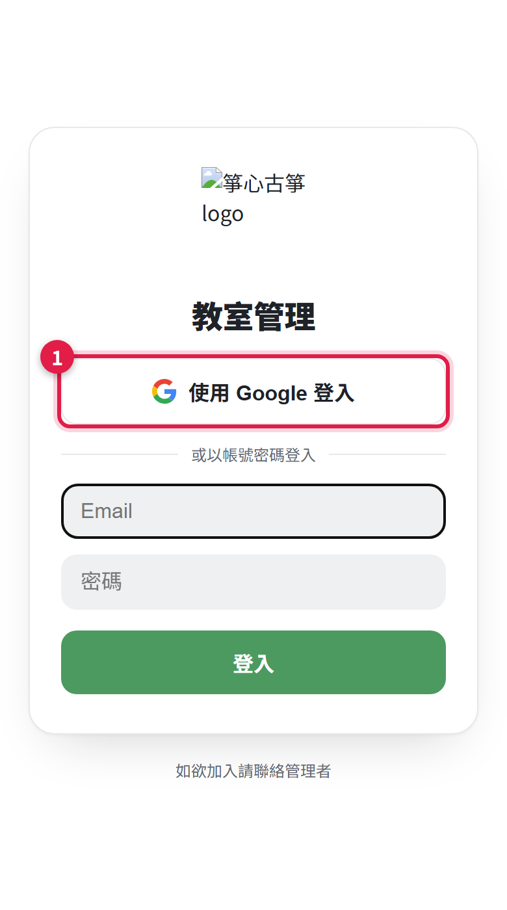

**①** 點「使用 Google 登入」。

只有白名單內的 Google 帳號進得去。沒有在白名單裡的人登入後會看到「無權使用」，要請管理者把 email 加進去。

---

## 二、每天的例行操作

### 上課核對 — 這是整套系統的資料來源

底部導覽點「核對」。

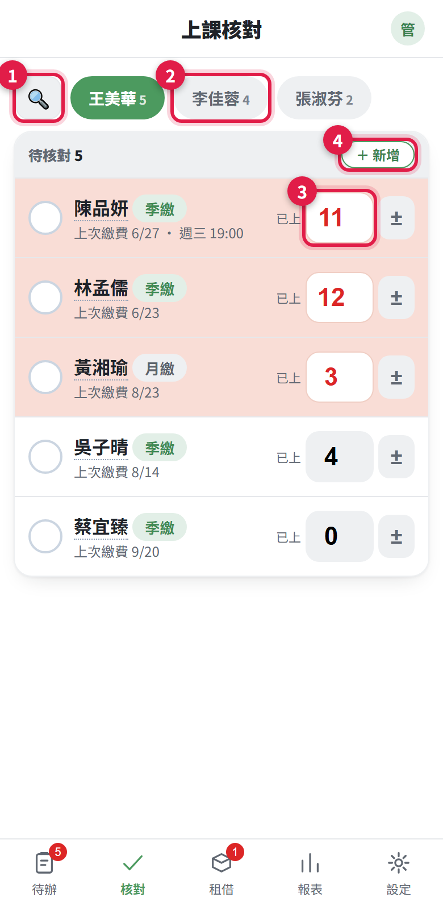

| | 這是什麼 |
|---|---|
| **①** | 搜尋。點開後可以**跨所有老師**找人（換過老師的學生也找得到） |
| **②** | 老師頁籤。切換要核對哪位老師的學生 |
| **③** | **已上堂數**。直接點數字改，不用開視窗。改完自動打勾變綠 |
| **④** | ＋新增。新增學生，會預設帶目前這位老師 |

**紅底的那幾列**＝已經達到催繳門檻的學生，同時會出現在「待辦」頁。

沒上課但要標記處理過的，點左邊那個圓圈就好。

#### 改過的會自動移到下面

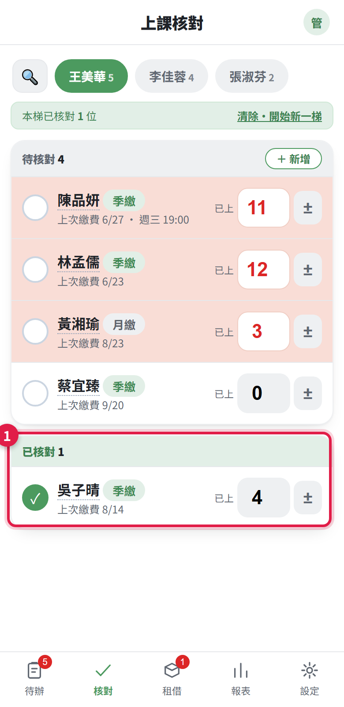

**①** 打勾或改過堂數的學生會自動移到下方「已核對」區，上面待核對的清單越來越短，不用上下滑找誰還沒處理。

**開新一梯**：頁頂會出現「清除全部 · 開始新一梯」，按下去清掉**所有老師**的勾選（只清勾選，不動堂數）。每週或隔週開新一輪時按一次。

#### 找特定學生

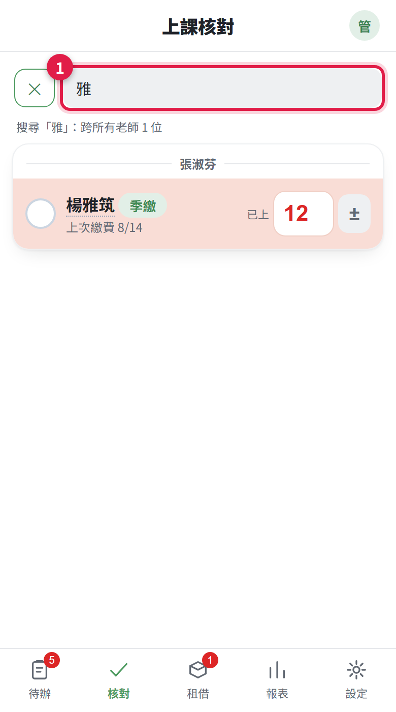

**①** 點搜尋圖示後欄位會展開，輸入姓名即時過濾，結果依老師分組。點任一老師頁籤就會清掉搜尋、回到正常清單。

---

### 記繳費

收到錢就記。**記完系統會自動扣堂數，不要再手動扣一次。**

最常用的入口是「待辦」頁——上面列的就是該催繳的人。

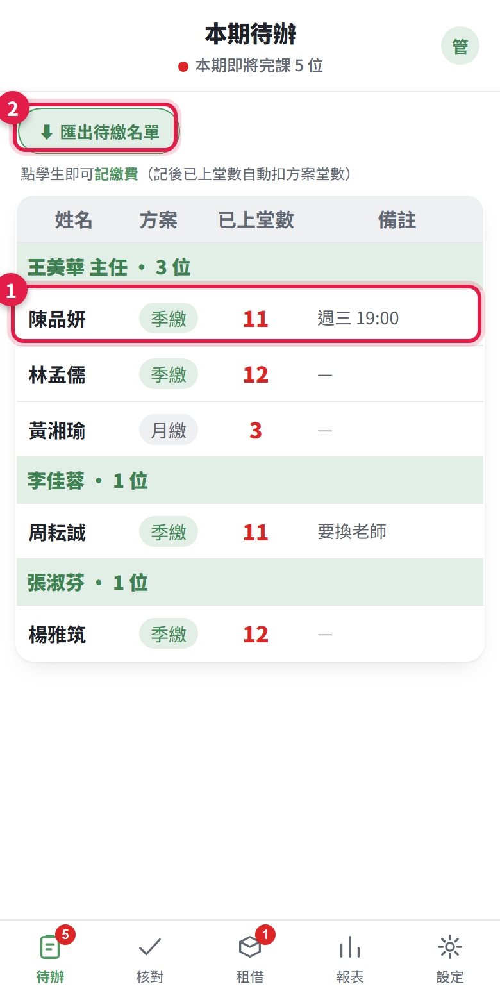

| | |
|---|---|
| **①** | **點學生這一列**就會跳出記繳費視窗 |
| **②** | 匯出待繳名單（CSV），當催繳清單用 |

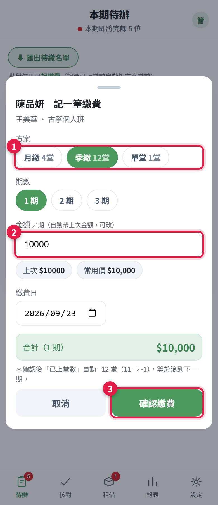

| | |
|---|---|
| **①** | 方案與期數。金額會自動帶上次的或方案常用價 |
| **②** | 繳費日，預設今天，可改 |
| **③** | 按「確認記繳費」。**已上堂數會自動 −（方案堂數 × 期數）** |

---

## 三、各種情況怎麼處理

### 新生報名 — 一次做完，不要分兩步

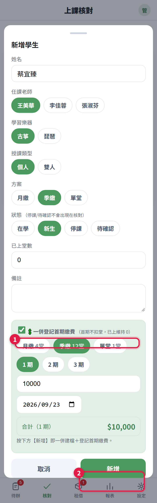

| | |
|---|---|
| **①** | **勾「💲 一併登記首期繳費」**，展開後填方案、金額、繳費日 |
| **②** | 按【新增】，同時完成建檔＋記一筆繳費 |

**首期不扣堂**，已上維持 0，之後上課才往上加。

> ⚠️ 如果先建檔、再進去記繳費，會變成 `0 − 12 = −12`，系統以為他還有兩期的量，會晚一整期才提醒你催繳。

### 停課 / 復課

- **停課**：編輯學生 → 狀態改「停課」。停課的人不會出現在核對頁和待辦頁，資料都留著
- **復課**：報表頁 →「已停課（流失）名單」→ 該列的 **↩ 復課** 按鈕

### 刪掉一位學生

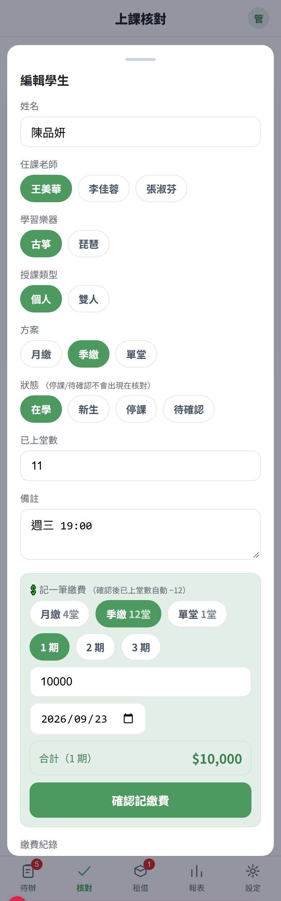

**①** 最下方的「🗑 刪除這位學生」。

這是**註記刪除**：學生從 App 消失，但**繳費紀錄、租借紀錄、報表歷史全部保留**。

點下去會跳出確認視窗，依那位學生實際的資料列出保留了哪些：

```
確定刪除學生「陳品妍」？

資料不會真的消失，只是不再出現在 App 裡：
・繳費紀錄 2 筆　保留（報表營收照算）
・租借紀錄 1 筆　保留

刪除後無法在 App 內還原，需由管理者從資料庫處理。
```

沒有任何紀錄的學生，第二段會顯示「這位學生沒有繳費或租借紀錄。」

> 建了重複的學生請用刪除，**不要改成「停課」**——停課是真的有在用的狀態，混用會讓報表失真。
> 要救回來得從資料庫把 `deleted_at` 清掉，App 裡沒有還原按鈕。

### 換老師

編輯學生 → 換任課老師 → 存檔。系統自動記一筆異動歷史（何時、從誰換到誰），下次打開這位學生就看得到。

### 雙人班配對

授課類型選「雙人」後會多一欄「雙人組同學」，挑同老師、同為雙人班、在學的另一位。**存檔時雙向自動同步**，不用兩邊都設。

第一位建檔時對方還不存在，會顯示「等對方建檔後再配對」。兩人的繳費各自獨立。

---

## 四、器材租借

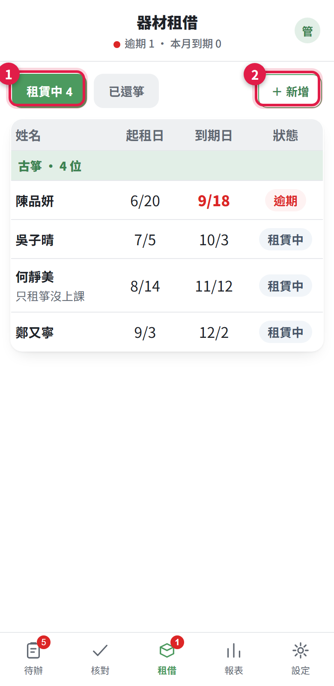

| | |
|---|---|
| **①** | 租賃中／已還箏 分頁 |
| **②** | ＋新增租借 |

到期日的顏色：**紅＝逾期**、琥珀＝本月到期、黑＝還早。

### 新增租借 — 承租人要從名單挑

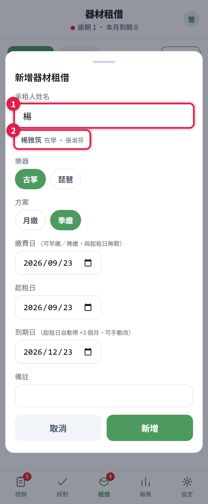

| | |
|---|---|
| **①** | 在承租人姓名欄**開始打字** |
| **②** | 跳出學生建議，**點它** |

點選之後姓名會變成**系統記的寫法**（不是你打的字），並自動連上那位學生，老師欄也會帶出來。

> 為什麼要點選：以前是自由輸入，只有一字不差才會連上學生，差一個字就靜靜斷鏈、畫面上看不出來。斷鏈的租借在需要把學生與租借合起來看的功能裡會整個漏掉。

#### 系統裡沒有這個人也可以存

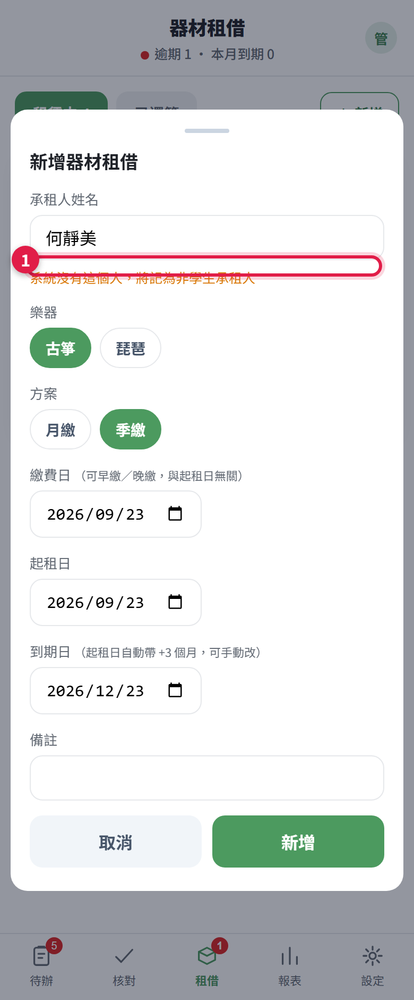

**①** 只租箏沒上課、或很久以前的舊生，會顯示橘字提醒，但照樣存得起來。

**同一人同樂器已經在租**的話，按存檔會提醒你該用「續租一期」。古箏＋琵琶各一筆是合理的，不會擋。

### 續租、還箏、改錯了

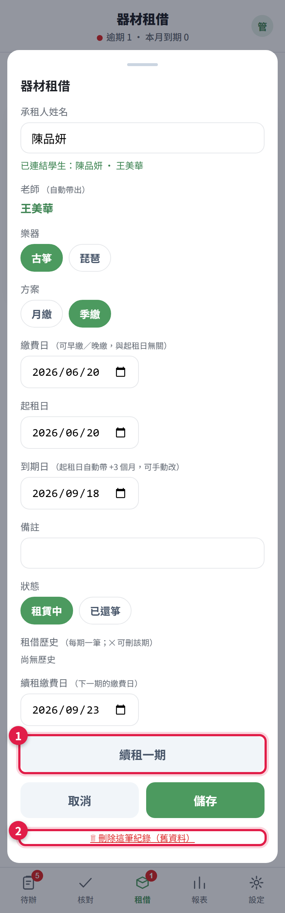

| | |
|---|---|
| **①** | **續租一期**。可選續租繳費日 |
| **②** | 刪除整筆租借紀錄 |

**續租的日期規則：新起租日＝舊的到期日**，不是繳費日。

> 因為箏一直在學生手上，逾期不代表他搬回來還你。從繳費日起算等於逾期越久租越久。

**還箏**：狀態改「已還箏」→ 出現「還箏日」（預設今天）→ 存檔。

**某一期記錯**：租借歷史裡該列的 ✕。刪最新一期＝撤銷那次續租，租期會退回上一期。

**押金**：只租箏不上課的學生才收，**不延長租期**，還箏時退還。

---

## 五、每月的事

### 看報表

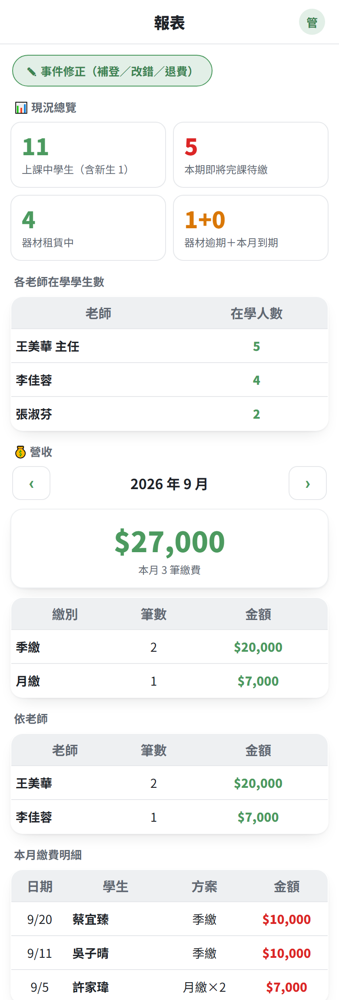

現況總覽、各老師學生數、月營收（可切月份）、已停課名單。底部可匯出繳費明細與租借清單（含 UTF-8 BOM，Excel 開中文不亂碼）。

> ⚠️ 營收只算 **App 裡記的繳費**。以前從 Excel 匯入的歷史只帶了最後繳費日、沒有逐筆紀錄，所以舊月份的營收會偏低。

### 改錯的繳費紀錄

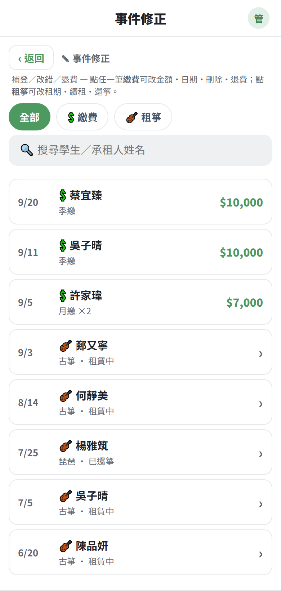

報表頁 →「✎ 事件修正」。繳費與租箏整合清單，可篩選、搜尋。點繳費事件可以改金額、改日期、刪除，或記一筆退費（另存負數）。

> ⚠️ 事件修正**不會動已上堂數**，純粹修正紀錄。堂數要調就直接去核對頁改。

### 設定

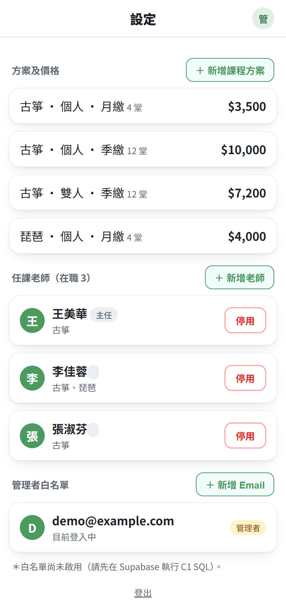

方案常用價、老師管理（新增／停用，不做刪除）、目前登入帳號、登出。

---

## 六、跟財務報表對帳

用來確認「帳本收的錢，系統有沒有記到」。在電腦上跑，**全程唯讀，不會改動任何資料**。

### 步驟

1. 把 Google 財務試算表匯出成 Excel，蓋掉 `D:\app\箏心古箏資料.xlsx`
   （**不做這步就是拿舊資料對帳，而且不會報錯**）
2. 開終端機，到 `D:\app`，執行：

```bash
py tools/compare.py
```

### 看什麼

產出在 `D:\app\data\`：

| 檔案 | 內容 |
|---|---|
| `對帳結果.csv` | 每位學生：報表 vs 系統 |
| `缺漏學生清單.csv` | 報表有收款、系統查無此人（附逐筆日期金額） |
| `排除名單.txt` | 你維護的「不需處理」名單 |

`對帳結果.csv` 的「對帳結果」欄：

| 標記 | 意思 | 要做什麼 |
|---|---|---|
| ✅ 相符 | 兩邊一致 | 不用管 |
| ⬜ 正常（已停課/退學） | 停課的人今年沒繳費 | 不用管 |
| 🟡 帳本落後 | 系統比帳本新 | 通常是帳本還沒補記 |
| 🔴 **系統落後** | **帳本收了錢、系統沒更新** | **← 這個才要處理** |
| ⚠️ 在學但沒收到學費 | 可能預繳未到期或帳本漏記 | 看一下 |

### 排除名單

帳本涵蓋的人本來就比系統多——廖主任自己控管的學生、只記帳不進系統的人、體驗課。這些不是「缺漏」。

把他們的名字寫進 `data\排除名單.txt`（一行一個，`#` 開頭是註解），再跑一次就不會再出現在缺漏清單裡。**設定一次，以後都有效。**

---

## 七、數字的意思

### 已上堂數

不是「總共上了幾堂」，是**這一期上了幾堂**，繳費後歸零重算。

| 動作 | 怎麼變 |
|---|---|
| 上課 | 你手動 +1 |
| 記繳費 | 自動 −（方案堂數 × 期數）。季繳 12、月繳 4、單堂 1 |
| 新生首期繳費 | **不扣**，維持 0 |

**負數是正常的**，代表預繳。例：已上 5 又繳一期季繳 → `5 − 12 = −7`，表示還能上 18 堂才需要再催繳。

### 什麼時候會被列進待辦

| 方案 | 門檻 |
|---|---|
| 季繳 | 已上 > 10 |
| 月繳 | 已上 ≥ 3 |
| 單堂 | 已上 ≥ 1 |

達門檻的數字會變紅，並出現在待辦頁。

### 租箏狀態

到期日 < 今天＝**逾期**（紅）；到期日在本月＝**本月到期**（琥珀）；其餘＝租賃中。

---

## 八、出狀況怎麼辦

| 症狀 | 原因與處理 |
|---|---|
| 改了東西但畫面沒變 | 重新整理。App 每個動作是先改畫面、再背景存，存失敗會跳提示 |
| 看到舊版功能 | 線上版設定了不快取，重新整理即可 |
| 堂數被扣了兩次 | 記繳費會自動扣堂，不要再手動扣。扣錯就去核對頁改回來 |
| 同一筆繳費記了兩次 | 報表頁 →「✎ 事件修正」→ 找到那筆刪掉。堂數要自己回去調 |
| 誤刪學生 | App 裡無法還原，要從資料庫把 `deleted_at` 清掉 |
| 對帳結果怪怪的 | 先確認 `箏心古箏資料.xlsx` 是不是最新匯出的 |
| App 很久沒用會不會停掉 | 不會。`.github/workflows/keepalive.yml` 每週一、四自動 ping |

---

## 九、給接手的人

- **改 App**：改 `D:\app\prototype\` 裡的檔案，提交推上 GitHub `main`，Netlify 會自動部署
- **本機預覽**：`py tools/devserver.py` 然後開 <http://localhost:5500>
- **查資料庫**：`py tools/db_select.py "SELECT ..."`。這支**只能 SELECT**，語法白名單＋唯讀連線雙重保護
- **改資料庫結構**：另外寫一次性腳本，參考 `tools/migrate_add_deleted_at.py`
- **重產本手冊的圖**：`py tools/shoot_manual.py`（用 `docs/手冊/demo.html` 的假資料，不碰正式資料庫）
- **密碼**：`D:\app\.env.local`，已被 gitignore 擋住，**絕不可進版控**（repo 是公開的）
